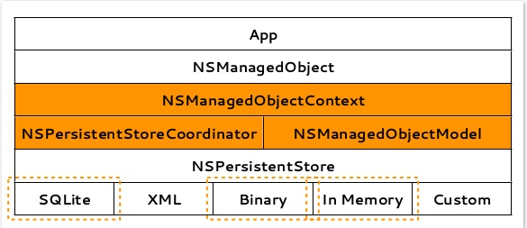
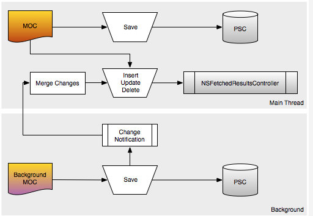
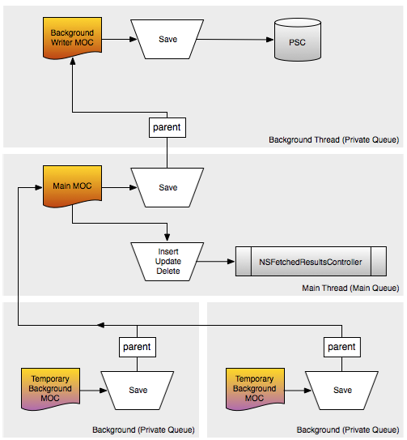

## Core Data 并发 ##
* Core Data 结构图 
* Core Data 并发图

#### Core Data 结构图 
_首先,来看下Core Data的结构图_  

>  

从上图可以清楚的看出,Core Data不是数据库,而数据库只是Core Data的一种存储方式而已,整个Core Data的架构是用一个上下文里的PSC协调器来调节ObjectModel与PersistentStore之间的一种关系,对外输出的是NSManagedObject对象。 
 
#### Core Data 并发图

苹果官方给出了两种Core Data并发的方案:
> 1.Create a separate managed object context for each thread and share a single persistent store coordinator.
This is the typically-recommended approach.

> 2.Create a separate managed object context and persistent store coordinator for each thread.
This approach provides for greater concurrency at the expense of greater complexity (particularly if you need to communicate changes between different contexts) and increased memory usage.  

先来看第一种,每个线程拥有一个独立的上下文,但是共享同一个PSC,第二种每个线程拥有独立的上下文和独立的PSC,但是会增加更大的开销和内存,并且处理起来更加的复杂。

现在我们大致知道了,如果要解决并发问题,我们只需要在上下文和PSC做出相应的研究就可以了。

_注意几点_:  
1.线程之间的数据传递用objectid,而不是object,因为objectid是线程安全的.    
2.注意一种情况,如果对线程A进行了DidSaveNotification监听,在线程B中执行insert,update,delete操作,线程A是能感知到的,并处理相应的方法,但关键是线程A是不能操作这些object的,因为太慢不在同一个MOC里,这时候就需要我们去merge.  

>  

现在来考虑另外一种情况,如果coredata需要开启多个线程,而不是上图的一条线程,并且UI的数据部分只能在主线程中获取,为了避免不必要的UI阻塞,我们有了如下设计:

> 
 
对于CoreData还需要明白一点,NSManageObject从CoreData里取出来以后,对象存储在内存中,任何对该对象的属性的修改,不用写回到PSC,也会影响UI的数据部分.

关于最后一部分有个疑问,既然NSFetchedResultController于PSC无关,并且NSFetchedResultController是在主线程中,那么如何保证Insert/Update/Delete成功后才更新UI呢?这个问题后期研究.

###参考链接:
http://www.cocoanetics.com/2012/07/multi-context-coredata/
