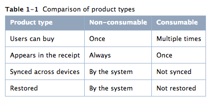
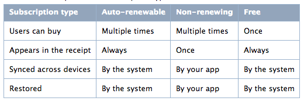
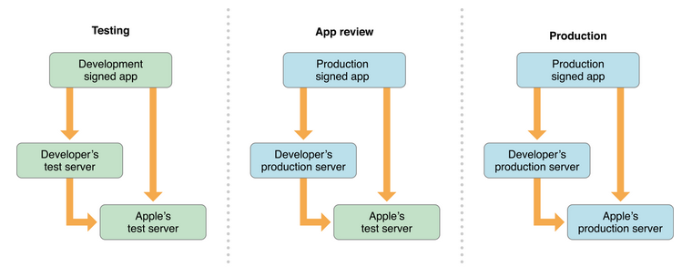

## In-App-Purchase ##

#### 使用In-App-Purchase 可销售的类型  

* 内容:如杂志,图片或艺术品等  
* App 功能:解锁行为或扩展功能  
* 服务:一次性的服务,如语音转录及持续服务,或访问数据的集合

#### 使用In-App-Purchase 不可销售的类型

* 实物或实际的服务:使用不同的付费机制,使用信用卡或其他的支付行为  
* 不合适的内容:暴力,黄色等不适合app审核的内容  

#### 产品类型  

* 消费类型  
* 非消费类型  
* 自动订阅类型  
* 非自动订阅类型  
* 免费订阅类型  

_不同产品类型的比较_
>
>

#### 关于购买的测试部分及步骤
* 登录测试账号
* 关于获取产品唯一id的测试:包括服务端的测试,是否使用了标准的http缓存机制  
* 关于无效产品id的处理+测试:通过故意包含一个无效产品id来测试,测试完毕后删除  
* 关于产品请求的测试:SKProductsRequest  

#### 不寻常活动的检测  
* applicationUsername(iOS7提供):可以理解为不同的appStore账号购买行为,苹果将返回不同的applicationUsername,可以解决一个用户账号,使用多个appStore账号购买的异常行为.

#### 事物的4中购买状态  
>

#### 持久购买
>
* For non-consumable products and auto-renewable subscriptions in iOS 7 and later, use the app receipt as your persistent record.
* For non-consumable products and auto-renewable subscriptions in versions of iOS earlier than iOS 7, use the User Defaults system or iCloud to keep a persistent record.
* For non-renewing subscriptions, use iCloud or your own server to keep a persistent record.
* For consumable products, your app updates its internal state to reflect the purchase, but there’s no need to keep a persistent record because consumable products aren’t restored or synced across devices. Ensure that the updated state is part of an object that supports state preservation (in iOS) or that you manually preserve the state across app launches (in iOS or OS X). For information about state preservation

简单翻译下就是
  
* 非消费类型和自动订阅类型,在ios7以后,请使用app收据来保持持久记录  
* 非消费类型和自动订阅类型,在ios7以前,可以使用用户系统和iCloud来保持一个持久记录  
* 非自动订阅类型,使用iClound或你自己的服务器来保持一个持久记录  
* 消费类产品,是否要保持一个持久记录,由你自己的服务器来决定  

#### 关于使用app收据
* 由苹果负责加密和签名,对于消费类型和非自动订阅类型,苹果将为你保持到交易结束,并在用户进行下次购买之前,也不会删除本次交易记录  
* 所有的其他类型,苹果将会为你永久保留收据  

#### 提供相关内容   
* 下载托管在苹果服务器的数据
* 下载自己服务器的数据
	1. 把收据发给服务器,并请求数据  
	* 服务器验证收据  
	* 假设收据是有效的,服务器提供内容  
	* 确保程序能正常处理错误,如当磁盘不够时,停止下载,当空间足够时,恢复下载  

#### 一个交易的完成  
* 持久化购买  
* 下载相关内容  
* 更新程序UI让用户获取产品  

#### 计算订阅的活跃时间

#### 过期与更新  
* 预检查期,在订阅到期的前十天,AppStore可能延缓或阻止自动续购(如用户不再拥有一个活跃的付款方式,如果产品不再可用,如果产品涨价了)在订阅自动续费之前,appStore将通知任何问题用户去处理相关问题,以保证他们的订阅不被打断。
* 订阅到期前的24小时内,AppStore开始尝试自动更新它。如果有太多失败的尝试,appStore将停止更新.

#### 取消  
* 用户可以通过客服取消订购,并退还RMB(疑问,已经购买并下载了相关服务的,如何解决退款问题?)

#### 订购测试  
* 订购测试,每天最多只可以生成六次订阅,这可以处理你的app如何处理续订,订阅失败等

#### 测试环境图  
>

#### 恢复购买问题  
* 从苹果网站恢复购买:restoreCompletedTransactions

#### 流程总结
* 在iTunes Connect 配置相关产品信息,在这个过程中可以修改产品信息,但是你需要至少一种产品id
* 获取一个产品唯一id列表,可以通过app bundle文件,也可以通过你自己的服务器
* 在你的商店实使用SKProduct实现用户界面  
* 像transaction queue addPayment 加入SKPayment来请求
* 实现queue的监听,并实现paymentQueue:updatedTransactions: 方法
* 通过购买未来还未发生的持久性记录,来下载相关内容,并调用finishTransaction方法  

如果你的app销售非消费类型,自动订阅类型或非自动订阅,请实现下边的逻辑  

* 提供开始恢复的UI界面  
* 使用SKReceiptRefreshRequest类,并用restoreCompletedTransactions方法来恢复  
* 让用户重新下载内容.  

如果你销售自动订阅或非自动订阅,请验证你已经实现了以下的逻辑  

* 通过最新发布的新内容来测试你的新订阅  
* 当新内容发布时,使它对用户有效
* 当一个订阅实效的时候,让用户续订它  
	1. 如果是自动订阅,请让AppStore来处理它,不用你处理  
	2. 如果是非自动订阅,你的app应该能够合理处理它  
* 当订阅变得无效的时候,停止制造新的可用的内容,并更新你的接口,让用户可以选择重新订阅,并激活它  
* 当内容发布的时候,实现一些系统跟踪,使用系统来恢复购买,如果在这期间,订阅是有效的  

