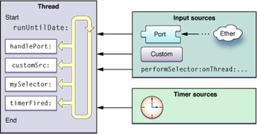
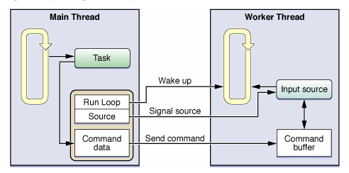

# NSRunloop编程
* 思考 : 我们在开发过程中经常这样思考,开启一条后台线程,如何让线程在有数据的时候工作,没有数据的时候休眠,以节约各种系统资源,NSRunloop可以实现之.
* 概念 : NSRunLoop是一个事件循环,不停的调度处理输入事件.
* 目的 : 让线程在有数据的时候可以工作,没有数据的时候休眠.
* 原理 : 每次运行runloop,都要为观察者,输入源,定时源制定特定的模式,只有和模式相关的源才会被监听,并传递相关信息,否则就会处于暂停状态.

> 

__线程与NSRunLoop的关系__  
在线程开始到线程结束时,有一个循环监测数据源的机制,这个机制就是runloop,

## 自定义输入源

>   

__图解__  
1.主线程发起一条任务给工作线程,工作接收到任务并放入Command Buffer中.  
2.发起任务的方式为:wake up runloop(唤醒工作线程) 和 signal source(输入源信号量).  
3.工作线程调用输入源处理程序,执行Command Buffer中相关命令.  

__操作一个自定义的输入源__  
在主线程中开启一新线程,在新开的线程中操作步骤如下:  
1. 创建RunLoopSourceContext,并定义好schedule,perform,cancel方法,以便于runloop回调.  
2. 创建RunLoopSource,传入RunLoopSourceContext的引用.  
3. 获取当前线程的NSRunLoop,并注册RunLoopSource,此时会回调schedule方法.  
4. 运行RunLoop  
5. 线程完成时或需要结束时,Remove RunLoop.  
6. 释放RunLoopSource
### 代码如下:
<code><pre>
@interface TESTAppDelegate(){
    CFRunLoopSourceRef _runloopSource;
    CFRunLoopRef _runloop;
}
@end  

@implementation TESTAppDelegate
//开启一条新线程
- (void)createThread{
    dispatch_async(dispatch_get_global_queue(DISPATCH_QUEUE_PRIORITY_DEFAULT, 0), ^{
        //在线程中加入一个输入源
        [self createCustomRunLoopSource];
    });
}
@end  
// This callback is called when the source is added to a run loop mode.
static void	schedule(void *info, CFRunLoopRef rl, CFStringRef mode)
{
    printf("hello\n");
}  
//This callback is called when the source has fired.
static void	perform(void *info)
{
    //void * : 无类型指针,可以指向任何的类型,无需强制转换
    //void : 作用1,对函数返回的限制 作用2,对函数参数的限定
    printf("perform －－");
}  
// This callback is called when the source is removed from a run loop mode.
static void	cancel(void *info, CFRunLoopRef rl, CFStringRef mode)
{
    printf("cancel\n");
}  
BOOL running = YES;
- (void)createCustomRunLoopSource
{
    CFRunLoopSourceContext context = {0,self,NULL,NULL,NULL,NULL,NULL,schedule,cancel,perform};
    CFRunLoopSourceRef sorce = CFRunLoopSourceCreate(kCFAllocatorDefault, 0, &context);
    CFRunLoopRef runloop = CFRunLoopGetCurrent();
    _runloopSource = sorce;
    _runloop = runloop;
    CFRunLoopAddSource(runloop, sorce, kCFRunLoopDefaultMode);
    while (running) {
        @autoreleasepool {
            CFRunLoopRun();
        }
    }
    CFRunLoopRemoveSource(CFRunLoopGetCurrent(), sorce, kCFRunLoopDefaultMode);
    CFRelease(sorce);
}

</pre></code>
